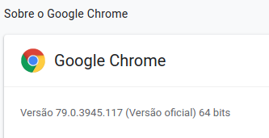

# Preenchimento-do-Google-forms
``` não dou suporte de instalação em MAC ou windows.```
1. pré-configuração
2. guia de uso
3. Sobre o selenium
4. exemplos de aplicações

## Pré-configuração
No seu browser google chrome clique em opções (três pontinhos)-> ajuda-> sobre o google chrome.



Feito o download descompacte e cole o arquivo chromedriver em:<br>
``` /usr/bin/```<br>
faça o dowload para versão do seu browser em:<br>
https://sites.google.com/a/chromium.org/chromedriver/downloads<br>
use o pip,gerenciador de pacotes do python para instaçar o a biblioteca selenium.<br>
```sudo pip3 install selenium``` 
## Guia
Por motivos de generalidade usamos xpath,uma forma de localizar mais genérica, alguns programadores ruins não colocam atributos ID e NAME em todos elementos.<br>

Antes de começar você deve importar a biblioteca e criar uma variável com um browser:<br>
``` 
import tadWeb
browser = tadWeb.open_init("https://www.google.com/")
``` 

Você vai abrir a página e abrir o modo desenvolvedor e selecionar o elemento de que você deseja usar.<br>

<br>
Feito isso clique com o botão direito sobre o código na parte de desenvolvedor, copy-> copy Xpath.<br>
```//*[@id="tsf"]/div[2]/div[1]/div[1]/div/div[2]/input```<br> 
troque as aspas duplas " por simples '

<br><br>
Caso seja um input de texto use a função:<br>
``` 
tadWeb.escrever(browser,"//*[@id='tsf']/div[2]/div[1]/div[1]/div/div[2]/input","Nelson Mandela")
```
<br>

Caso seja um botão use a função:<br>
```
tadWeb.clicar(browser,"//*[@id='tsf']/div[2]/div[1]/div[3]/center/input[1]")
```
<br>

## Sobre o selenium
Selenium é uma biblioteca que faz o python se comunicar com Browser, sua finalidade é automatização de testes de funcionalidade em aplicações web., porém vou deixar uma pequena história sobre o viagra.
```
A milagrosa pílula azul surgiu por acaso, quando a empresa americana Pfi zer pesquisava um novo medicamento para tratar a angina, uma doença cardíaca. Durante os testes da droga, em 1994, os pesquisadores Nicholas Terrett e Peter Ellis, funcionários da Pfi zer, descobriam que um de seus efeitos colaterais era o aumento da irrigação sangüínea no pênis, a partir da potencialização do óxido nítrico. Os ingleses Peter Dunn e Albert Wood conseguiram sintetizar o composto numa pílula, aprovada pelo FDA (o órgão que regulamenta medicação nos EUA), em 1998, como o primeiro remédio contra a impotência. No mesmo ano, os americanos Robert Furchgott, Louis Ignarro e Ferid Murad dividiram o Nobel de medicina por seu trabalho com o óxido nítrico, sem o qual seria impossível a criação do Viagra.
``` 
mais em : https://super.abril.com.br/comportamento/viagra/
<br>
o selenium é uma otima ferramenta para uso de testes automatizados de interface, porém pode ser usados com outros fins, eu não indicaria para força bruta pois tem uma alta latência devida a renderização de imagens e CSS, porém pode ser feito.

Para ataque de força bruta eu usaria urllib.
## Exemplo

1. [login facebook](facebook-login.py)
2. [busca no Google por nelson mandela](busca-google.py)